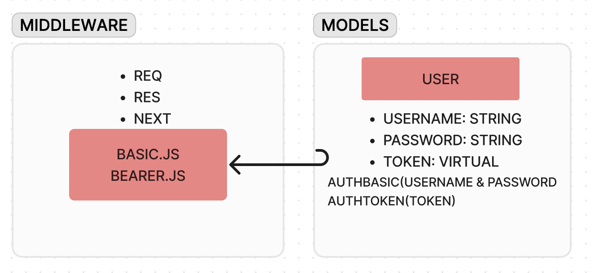

# bearer-auth

**Author**: Wajiha Khan

**Version**: 1.0.0

**Whiteboard**:

**Overview**:

The provided code consists of an authentication system implemented in Node.js. It utilizes Express.js middleware for handling basic and bearer token authentication. User authentication is managed through a Sequelize-based model, which includes methods for basic and token-based authentication. The system is structured with clear separation of concerns, employing middleware for authentication logic and models for database interactions. Additionally, error handling middleware is implemented to manage errors gracefully.